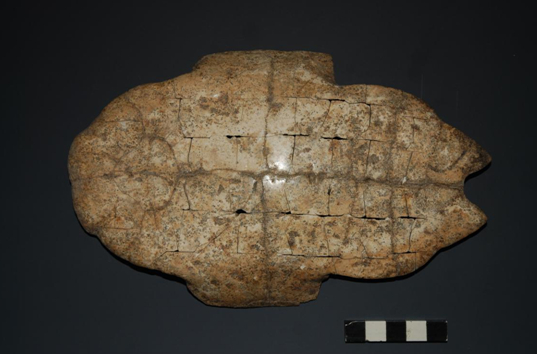
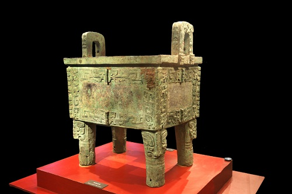

### 文字博物馆

---

</img>

​		中国文字博物馆位于甲骨文的故乡——河南省安阳市，是经国务院批准建设的集文物保护、陈列展示和科学研究为一体的国家级博物馆，是中华汉字文化的科普中心，全国科普教育基地，爱国主义教育基地。

　　中国文字博物馆基本陈列以世界文字为背景，以汉字为主干，以少数民族文字为重要组成部分，荟萃历代中国文字样本精华，讲解中国文字的构形特征和演化历程。展览以详实的资料、严谨的布局、科学的方法和现代化的展示手段充分展示中华民族一脉相承的文字、灿烂的文化和辉煌的文明，同时反映华夏文明与中国语言文字的研究成果，具有普及性和学术性双重使命。

　　中国文字博物馆分两期建设，已于2009年11月16日建成开馆的一期工程占地81亩，建筑面积22700平方米，包括主体馆、字坊、广场等。已开工建设的续建工程占地175亩，建筑面积68300平方米，包括文字文化研究交流中心和文字文化演绎体验中心等。

　　续建工程完成后，中国文字博物馆将成为功能完善、面向国内外开放的知识型、信息型博物馆，成为向全世界展示中华文化的窗口和国际性文化交流平台。

#### 馆藏文物

---

##### 卜甲

​		古代占卜用的龟甲。多用龟腹甲，也有用背甲的。先钻凿、再火灼。据灼烧之裂纹推测吉凶，决定行止。刻上卜辞、验辞等内容。现见卜甲多出土于殷墟，郑州商代遗址、周原西周遗址中也有发现。该文物出土于殷墟花园庄东。殷墟花园庄东地甲骨，是中国社会科学院考古研究所于1991年秋在殷墟花园庄村东H3发掘的。该甲骨坑距花园庄村100余米，坑口距地表1.2米，近长方形。坑长2米、宽1米、深2.5米，保存完整。坑中出土甲骨1583片，其中有字甲骨为689片，以大片和完整的居多。这是继1936年小屯村东北地YH127坑甲骨、1973年小屯南地甲骨发现以来，殷墟甲骨文的第三次重大发现，备受学术界关注，被评为1991年全国考古十大发现之一。

##### 贾伯壶

　　2012年11月16日上午，中国文字博物馆隆重举行开馆三周年国宝“贾伯壶”首展揭幕仪式。中国文字博物馆开馆三年以来，在上级文物主管部门的重视指导下，在社会各界的鼎力支持下，始终将文物征集工作做为立馆根本，重中之重，常抓不懈，并取得了可喜的成绩。尤其西周重器贾伯壶的征集入藏是开馆至今征集到馆的最为珍贵的文物，是我馆文物征集工作进程中的一个重要里程碑，其入藏充实了我馆馆藏，填补了我馆没有成对青铜壶的空白。

---

### 殷墟

---

​		殷墟，位于中国历史文化名城——安阳市的西北郊，横跨洹河南北两岸。古称“北蒙”，甲骨文卜辞中又称为“大邑商”、“邑商”，是中国商代晚期的都城，也是中国历史上第一个有文献可考、并为甲骨文和考古发掘所证实的古代都城遗址，距今已有3300年的历史。 

---

 ##### 司母戊鼎

​		商代是中国青铜时代的第二个王朝，与世界上的其他文明古国相比较，殷墟的青铜文化有着鲜明的中国特色，以青铜礼器为基础，发展成为一套以等级为核心的礼制制度，在中国延续了数千年，这在世界青铜文明中是绝无仅有的，体现出独特的东方色彩。殷墟出土青铜器种类繁多，器形厚重，纹饰繁缛，铸造工艺高超，达到了前所未有的水平。其中尤以王陵遗址出土的司母戊大鼎最负盛名，大鼎高达133厘米，器口长79.2厘米，重量达875公斤，它是至今世界上发现最大的青铜器，代表了中国古代青铜文化的最高水平。原件现藏中国国家博物馆，此鼎造型庞大雄浑，纹饰精美细腻，通体以雷纹为底纹，饕餮纹、夔纹为主体装饰，给人以稳重、庄严而又神秘的感觉，是古代科技与艺术、雕塑与绘画的完美结合，是中国青铜器文化中的瑰宝，美术史上的璀璨明珠。

---

### (MORE TODO)

